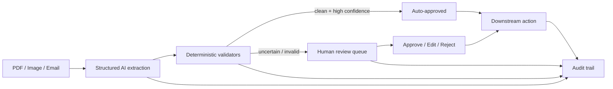

# Architecture

```mermaid
flowchart LR
    D[PDF / Image / Email] --> X[Structured AI extraction]
    X --> V[Deterministic validators]
    V -->|clean + high confidence| A[Auto-approved]
    V -->|uncertain / invalid| Q[Human review queue]
    Q --> E[Approve / Edit / Reject]
    A --> O[Downstream action]
    E --> O
    X --> L[Audit trail]
    V --> L
    Q --> L
    O --> L
```

The core design rule is that the model extracts; conventional application logic validates and controls side effects.
